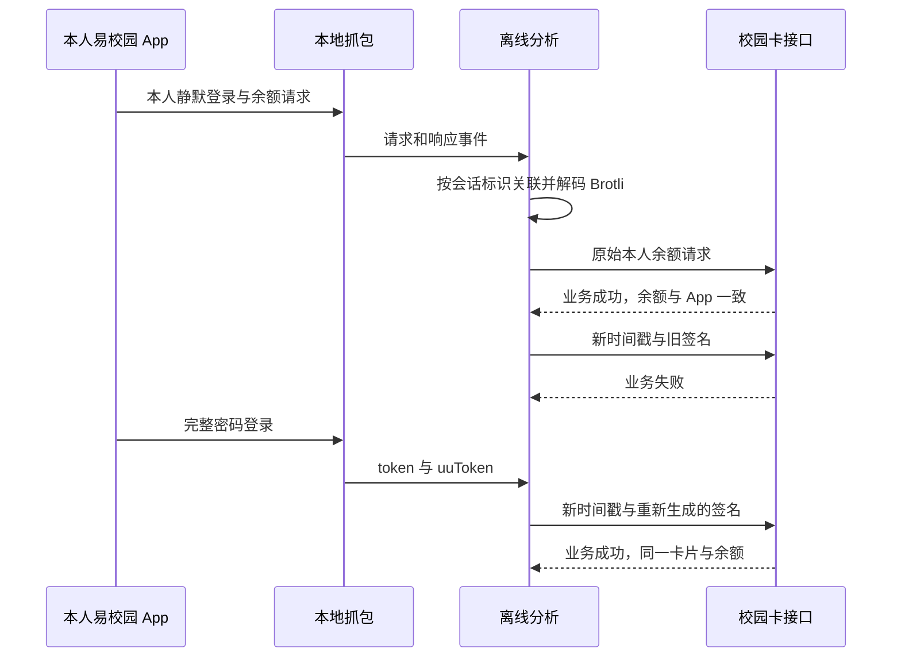

# 易校园本人余额查询分析记录

分析日期：2026-10-04，Asia/Shanghai。范围：用户已授权的本地样本、本人抓包与本人校园卡只读查询；不包括支付、充值和账户枚举。当前范围合同保存在本地 `work/scope.md`。本报告为普通协议逆向记录，flavor=null。

两份抓包提供了实际多卡余额接口和完整本人登录凭证，余额请求没有 Cookie。已还原新时间戳签名，使用完整登录响应生成真实余额查询，服务端返回业务成功，卡片和余额与原抓包及同期 App 一致。Telegram 连接消息已送达并经用户确认，Actions 已部署，真实查询与跨执行状态恢复通过；会话有效期和自动续期未验证。

## 样本与证据

| 证据 | 来源与定位 | 已验证结论 |
| --- | --- | --- |
| E1 | Payload 主程序，SHA-256 `92114ebfae33191e7063b9943b7bd5e226226ae2877c7d0b69525fb69b9a3c35` | 易校园 7.8.5，arm64，主程序 cryptid=0；没有原始 IPA，未验证压缩包完整性 |
| E2 | 抓包 SHA-256 `eb282a6b92261895e3fb117a317cc0e28a3ba7aa5f26855238b22138183d376e`，请求头字节偏移 16508084，响应头偏移 16537017，会话标识 546 | HTTP 200，Brotli 正文可解码，业务 `success=true`、`statusCode=0` |
| E3 | 抓包静默登录 `/login/doLoginBySilent`，请求头偏移 12191，响应头偏移 19738 | 学校与用户指定学校一致；账户和设备与余额请求一致；`data.keyMap` 为空 |
| E4 | 主程序 `0x1004d4dc8` → `0x100631124` → `0x100632138`；`0x100632270` 调用 CCHmac，`0x10063173c` Base64 编码 | sign 路径含 SHA-256/HMAC 和会话状态，不能用 Cookie 替代 |
| E5 | GlobalUtil 偏移 24 `sessionToken`、偏移 40 `sessionSecret`；`0x1005068e4` → `0x10050dfc8`，`0x10050e178` 写入密钥；`0x10050bf04` 读取 Keychain | token 与 uuToken 被保存到 Keychain；后者用于签名 |
| E6 | 本地 HTTPS 真实查询 | 原始请求重放成功；仅更新时间戳且保持旧 sign 返回 `success=false`、`statusCode="500"`，未产生有效余额记录 |
| E7 | 第二份抓包 `2026_10_04__12_07_02`，密码登录请求偏移 12822605 | 完整登录响应成功；游客分支计算 sign 与捕获值逐字节一致 |
| E8 | `client.py` 与 `tools/verify_client.py`，多次本人新签名 HTTPS 查询 | 新时间戳、新 sign、最新会话查询成功；同一张卡，金额与 App 一致；错误响应和卡片不符明确拒绝 |

原始正文、身份标识、凭证与完整响应仅保存在被忽略的本地 `work/` 中，不进入报告或提交。真实查询没有执行充值或消费。

## 实际协议

```text
POST https://compus.xiaofubao.com/routeauth/auth/route/auth/user/getMultiCardMoney
Content-Type: application/x-www-form-urlencoded; charset=utf-8
请求头字段：sign
请求体字段：appVersion、deviceId、nt、platform、token、ymId
```

该请求没有 Cookie 或 Authorization。抓包的 `appAllVersion` 为 7.8.5，协议参数 `appVersion` 为 740、`platform` 为 `YUNMA_APP`，不能根据展示版本或系统名称修改协议参数。

参数键按升序排列，排除 `sign`、`qqfile`、`file` 和空值，将参数值用 `|` 连接。游客请求的 seed 为 deviceId 前六个字符。登录后 seed 为 `ymId[int(ymId[-2]):] + deviceId[int(ymId[-3]):] + uuToken`；`0x10024e684` 的负偏移证明从末尾取位。seed 取 SHA-256 的小写十六进制表示后半 32 字符，使用该字符串的 UTF-8 字节为 HMAC-SHA256 key，结果进行 Base64 编码。完整登录签名和新签名实时查询分别验证了两条分支。静默登录缺少 uuToken 时 App 从 Keychain 恢复会话；客户端使用完整登录得到的私有配置。

成功响应顶层字段：`statusCode`、`message`、`data`、`success`。`data.authCardMoneyList` 返回一张卡，包含 `cardMoney`、`walletNo`、`walletName`。`data.firstWalletNo` 可关联该卡，`data.availableBalance` 与其余额一致。金额是十进制字符串，用户确认单位为元，后续应按 Decimal 或整数分处理；账户、卡号与金额不写入本报告。



## 结论与后续路径

- F1（高置信度，E2/E3/E8）：实际接口、本人卡片、金额字段和新签名查询已验证。P1：使用已完成的查询客户端。
- F2（高置信度，E4/E5/E7/E8）：独立生成签名可行，完整密码登录返回密钥。P2：会话失效后人工正常重新登录并更新私有配置。
- F3（未验证）：token 有效期和自动续期。P3：不能以多次查询成功推断长期有效。
- 首次基准、净余额变化通知与独立 state 分支已实现。通知显示“余额”，下一行显示“变动”；余额相同不生成新通知，已保存但发送失败的消息保留恢复。
- 三次 GitHub 托管运行通过，最终任务为 [37179863052](https://github.com/OyamaMeek/YXYtools/actions/runs/37179863052)；远端基准观察时间推进，余额相同，没有新增待发或确认消息。
- 时间窗口四个边界、实际 Git 推送失败及跨 checkout 待发恢复检查通过。真实消费产生的变化消息接收、整夜运行及真实凭证失效恢复尚未有现场证据；没有主动发起交易。

## 可复现离线检查

在项目根目录运行。检查脚本只支持上述哈希的这份抓包；使用系统已有 Brotli 1.2.0，不安装软件，不发送网络请求，不输出凭证。

```bash
python3 tools/verify_balance_capture.py yxy_app/2026_10_04__11_40_30 --expected-yuan 10.17
```

实际检查覆盖样本哈希、事件长度、请求/响应会话关联、正文解码、业务成功、唯一卡片和同期 App 余额一致。与实际余额不同的预期值应明确失败。该离线检查不替代新的实时查询、鉴权错误恢复或通知验收。

Swift 字段证据读取参考 [Swift 官方反射记录定义](https://github.com/swiftlang/swift/blob/main/include/swift/RemoteInspection/Records.h)，Mach-O 容器使用现有 macholib 读取。图为可编辑 Mermaid 源码，没有执行截图或图像渲染。
